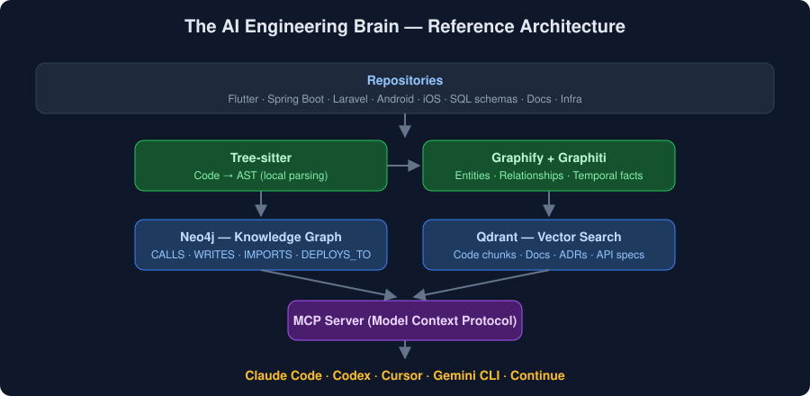
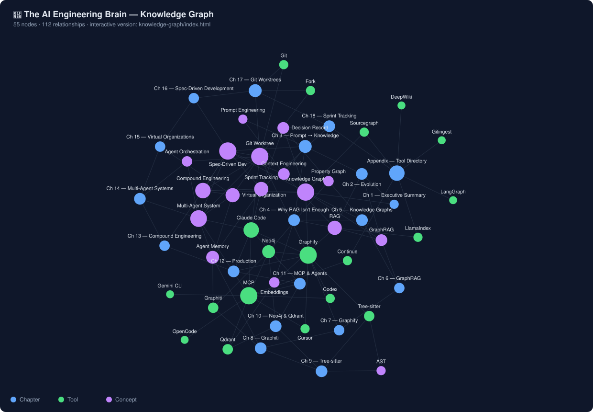
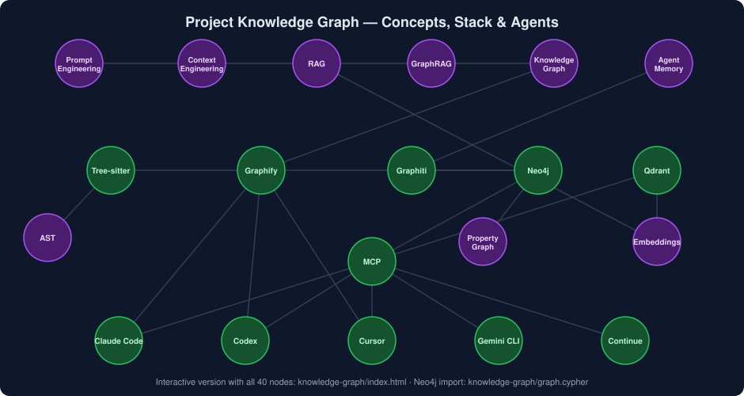

# 🧠 The AI Engineering Brain

**Building Knowledge Graphs for Next-Generation Software Engineering**

*A practical guide to Graphify, Graphiti, GraphRAG, Neo4j, Qdrant, Tree-sitter, MCP, and AI coding agents — 2026 Edition*

Modern AI coding assistants are powerful, but they mostly see your code as *text*. This open study library explains how to give them **architecture awareness, dependency awareness, and long-term memory** by combining knowledge graphs, vector search, and the Model Context Protocol — so tools like [Claude Code](https://claude.com/claude-code), [Codex](https://openai.com/codex/), and [Cursor](https://cursor.com) can answer questions like:

- *Which Flutter screens eventually write to the `users` table?*
- *What breaks if this service is removed?*
- *Which architectural decision introduced this dependency?*

  

---

## 📚 Table of Contents

### Part I — Foundations

| # | Chapter | What you'll learn |
|---|---------|-------------------|
| 1 | [Executive Summary](chapters/01-executive-summary.md) | The vision: what an AI Engineering Brain is and why it matters |
| 2 | [The Evolution of AI Software Engineering](chapters/02-evolution-of-ai-software-engineering.md) | Nine eras: from static docs to persistent engineering memory |
| 3 | [From Prompt Engineering to the AI Engineering Brain](chapters/03-prompt-to-knowledge-engineering.md) | Prompt → context → knowledge engineering as accumulating layers |
| 4 | [Why RAG Isn't Enough](chapters/04-why-rag-isnt-enough.md) | Chunking, the similarity trap, multi-hop reasoning — where vectors fail |
| 5 | [Knowledge Graphs](chapters/05-knowledge-graphs.md) | Entities, relationships, property graphs — the right data model for software |
| 6 | [GraphRAG](chapters/06-graphrag.md) | Building a production graph retrieval system: traversal, ranking, metrics |

### Part II — Technologies

| # | Chapter | What you'll learn |
|---|---------|-------------------|
| 7 | [Graphify](chapters/07-graphify.md) | Converting repositories into knowledge graphs: pipeline, internals, limits |
| 8 | [Graphiti](chapters/08-graphiti.md) | Persistent, temporal memory for AI systems — knowledge vs memory |
| 9 | [Tree-sitter](chapters/09-tree-sitter.md) | Language-aware parsing: the local, deterministic foundation |
| 10 | [Neo4j & Qdrant](chapters/10-neo4j-and-qdrant.md) | The storage layer: graph schema design and vector indexing |

### Part III — Integration & Production

| # | Chapter | What you'll learn |
|---|---------|-------------------|
| 11 | [MCP & AI Coding Agents](chapters/11-mcp-and-ai-agents.md) | Connecting the brain to Claude Code, Codex, Cursor, Gemini CLI, and more |
| 12 | [Costs, Deployment & the Road Ahead](chapters/12-costs-deployment-future.md) | Budgets, self-hosted vs SaaS, startup ideas, the 2027–2030 outlook |
| 13 | [Compound Engineering](chapters/13-compound-engineering.md) | The Plan/Work/Review/Compound loop, CLAUDE.md, solution docs, and how they feed the knowledge graph |

### Part IV — Organization

| # | Chapter | What you'll learn |
|---|---------|-------------------|
| 14 | [Multi-Agent Systems](chapters/14-multi-agent-systems.md) | Why single agents break, the monolith→microservices analogy, orchestration patterns, and when *not* to use a MAS |
| 15 | [Virtual Organizations](chapters/15-virtual-organizations.md) | From agent teams to AI companies: departments, governance, org-wide memory, and when *not* to build a VO |

### Part V — Practices

| # | Chapter | What you'll learn |
|---|---------|-------------------|
| 16 | [Spec-Driven Development](chapters/16-spec-driven-development.md) | Specs as the artifact you keep: acceptance criteria, the spec-driven loop, specs as graph knowledge, and when *not* to spec-drive |
| 17 | [Git Worktrees](chapters/17-git-worktrees.md) | Parallel filesystems for parallel agents: the agent-per-worktree pattern, runtime isolation, integration worktrees, and when *not* to use them |
| 18 | [Sprint Tracking](chapters/18-sprint-tracking.md) | The engineering record that writes itself: an `AGENTS.md`-declared tracker, decision logs with rejected alternatives, dashboard reading, and when *not* to track |
| 19 | [Loop Engineering](chapters/19-loop-engineering.md) | Designing the system that prompts the agent: loop anatomy, verifiable stopping conditions, the maker/checker split, the rails, five loop patterns, and when *not* to loop |
| 20 | [Graph Engineering in the Long-Context Era](chapters/20-graph-engineering-long-context.md) | Kimi K3's 1M-token window and KDA attention, working vs. persistent memory, the eight-layer stack, the borrowed numbers checked, and when *not* to build it |
| A | [Appendix: Tool Directory](appendix/tool-directory.md) | Reference catalog of 10+ tools with verified links and use cases |

> **New here?** Start with [Chapter 1](chapters/01-executive-summary.md) and follow the *Next* links at the bottom of each chapter.

---

## 🕸️ Project Knowledge Graph

This library practices what it preaches: the whole book — chapters, tools, and concepts — is modeled as a knowledge graph (55 nodes, 112 relationships).

  

<em>The complete graph — every chapter, tool, and concept. A static render of the interactive viewer below.</em>

<b>Stack topology only</b> — the same graph with chapters stripped out, for reading the tool/concept layer on its own

  

- **Explore interactively:** open [knowledge-graph/index.html](knowledge-graph/index.html) in a browser — drag nodes, hover for relationships, click to jump to a chapter or tool
- **Load it into Neo4j:** [knowledge-graph/graph.cypher](knowledge-graph/graph.cypher) imports the graph into the book's own recommended stack (`cat graph.cypher | cypher-shell`)
- **Raw data:** [knowledge-graph/graph.json](knowledge-graph/graph.json) · regenerate everything with [knowledge-graph/build.py](knowledge-graph/build.py)

---

## 🚀 TL;DR — The Recommended 2026 Stack

| Layer | Tool | Link |
|-------|------|------|
| Code parsing | Tree-sitter | [github.com/tree-sitter/tree-sitter](https://github.com/tree-sitter/tree-sitter) |
| Graph building | Graphify | [github.com/safishamsi/graphify](https://github.com/safishamsi/graphify) |
| Temporal memory | Graphiti | [github.com/getzep/graphiti](https://github.com/getzep/graphiti) |
| Knowledge graph | Neo4j | [neo4j.com](https://neo4j.com) |
| Vector search | Qdrant | [qdrant.tech](https://qdrant.tech) |
| Agent ↔ tool bridge | Model Context Protocol | [modelcontextprotocol.io](https://modelcontextprotocol.io) |
| Coding agent | Claude Code | [claude.com/claude-code](https://claude.com/claude-code) |

**Minimum setup:** Graphify + a coding agent. **Advanced:** add Neo4j, Qdrant, Graphiti, and MCP. Details in [Chapter 12](chapters/12-costs-deployment-future.md).

---

## 🎯 Who Is This For?

- **Individual developers** building a personal "engineering brain" across Flutter, Spring Boot, Laravel, Android, and iOS projects
- **Teams** who want their AI assistants to understand architecture, not just retrieve snippets
- **Builders** exploring GraphRAG, agent memory, or code-intelligence products

## 🤝 Contributing

This is a living library. Found an error, a broken link, or a new tool worth covering? Open an issue or a pull request.

## 📄 License

Content is licensed under [CC BY 4.0](LICENSE) — share and adapt freely with attribution.
