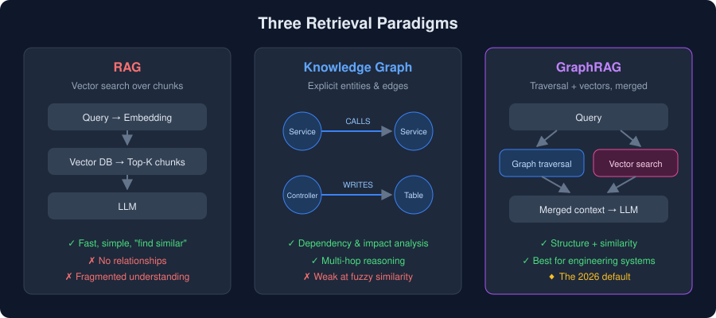

# Chapter 2 — RAG vs Knowledge Graphs vs GraphRAG

> [◀ Chapter 1](01-why-ai-assistants-need-more.md) · [🏠 Home](../README.md) · [Chapter 3 ▶](03-system-architecture.md)

---

Three retrieval paradigms dominate AI-assisted engineering. Understanding their trade-offs is the foundation for everything that follows.

<p align="center">
  
</p>

## 2.1 RAG (Retrieval-Augmented Generation)

Vector search over document chunks.

**Pipeline:**

```
Query → Embedding → Vector DB → Top-K chunks → LLM
```

**Strengths:** fast, simple, cheap to set up, great for "find something similar."

**Weaknesses:**

- No explicit relationships — the retriever doesn't know `UserController` *calls* `UserService`
- Fragmented understanding — each chunk is an island
- Weak at multi-hop reasoning ("what depends on what depends on this?")

## 2.2 Knowledge Graph

Stores **entities and relationships explicitly** as nodes and edges:

```
(Service) -[CALLS]->    (Service)
(Controller) -[WRITES]-> (Table)
(Feature) -[DEPENDS_ON]-> (Service)
```

**Strengths:**

- Dependency tracing — walk the graph in either direction
- Impact analysis — "what breaks if I remove this?" is a traversal, not a guess
- Precise, deterministic answers about structure

**Weaknesses:** graphs alone don't do fuzzy semantic matching — "where is authentication implemented?" is hard to answer with edges alone.

## 2.3 GraphRAG — The Best of Both

GraphRAG combines graph traversal with vector retrieval:

```
Query → Graph traversal + Vector search → merged context → LLM
```

- The **graph** answers: *"What depends on this?"*
- The **vectors** answer: *"What is similar to this?"*

Together they give an agent both structural precision and semantic recall. GraphRAG is widely expected to become the dominant retrieval pattern for large engineering systems. Microsoft Research's [GraphRAG project](https://github.com/microsoft/graphrag) popularized the term; tools like [Graphify](https://github.com/safishamsi/graphify) and [Neo4j's GenAI stack](https://neo4j.com/labs/genai-ecosystem/) apply it to codebases.

## 2.4 Quick Comparison

| | RAG | Knowledge Graph | GraphRAG |
|---|---|---|---|
| Retrieval unit | Text chunks | Entities & edges | Both |
| "Find similar code" | ✅ Strong | ❌ Weak | ✅ Strong |
| "Trace dependencies" | ❌ Weak | ✅ Strong | ✅ Strong |
| Multi-hop reasoning | ❌ | ✅ | ✅ |
| Setup complexity | Low | Medium | Medium–High |
| Best for | Small projects, docs search | Architecture analysis | Large engineering systems |

## 2.5 Takeaway

Use RAG when you need quick semantic search. Use a knowledge graph when structure matters. For a real engineering brain spanning apps, backends, and databases — use **GraphRAG**. The next chapter shows how to wire it together.

---

> [◀ Chapter 1: Why AI Assistants Need More](01-why-ai-assistants-need-more.md) · [🏠 Home](../README.md) · [Chapter 3: The Reference Architecture ▶](03-system-architecture.md)
