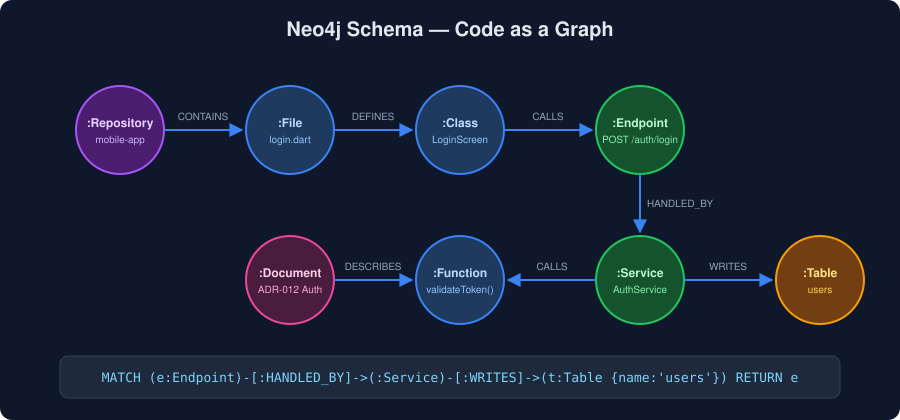

# Chapter 5 — The Storage Layer: Neo4j & Qdrant

> [◀ Chapter 4](04-graph-builders-graphify-graphiti.md) · [🏠 Home](../README.md) · [Chapter 6 ▶](06-parsing-and-mcp.md)

---

The brain needs two kinds of storage: a **graph database** for relationships and a **vector database** for similarity. They answer different questions and complement each other.

## 5.1 Neo4j — Relationships as First-Class Data

- **Website:** [neo4j.com](https://neo4j.com)
- **Free tier:** Neo4j Community Edition (self-hosted) or [AuraDB Free](https://neo4j.com/product/auradb/)

Unlike relational databases, [Neo4j](https://neo4j.com) stores relationships as first-class citizens. Every connection is directly queryable:

```
Frontend → API Gateway → User Service → PostgreSQL
```

### Schema Design for an Engineering Brain

<p align="center">
  
</p>

**Node labels:**

| Node | Represents |
|------|-----------|
| `Repository` | A codebase (Flutter app, Spring Boot API, Laravel admin…) |
| `File` | A source file |
| `Class` / `Function` | Code entities from AST parsing |
| `Service` / `Endpoint` | Runtime & API surface |
| `Table` / `Column` | Database schema |
| `Document` | ADRs, specs, papers |

**Relationship types:**

```
CALLS · IMPORTS · EXTENDS · IMPLEMENTS · READS · WRITES · DEPLOYS_TO
```

**Example Cypher patterns:**

```cypher
(:Controller)-[:CALLS]->(:Service)
(:Service)-[:WRITES]->(:Table)

// "Which endpoints touch the users table?"
MATCH (e:Endpoint)-[:CALLS*1..3]->(:Service)-[:WRITES]->(t:Table {name: 'users'})
RETURN e.path
```

Neo4j also ships [GenAI tooling and integrations](https://neo4j.com/labs/genai-ecosystem/) for knowledge graphs, RAG systems, and agent memory.

## 5.2 Qdrant — Semantic Search Over Everything Else

- **Website:** [qdrant.tech](https://qdrant.tech)
- **Free tier:** open source (self-hosted) or [Qdrant Cloud free cluster](https://cloud.qdrant.io)

[Qdrant](https://qdrant.tech) is a vector database: it stores embeddings so the agent can ask *"where is authentication implemented?"* and retrieve relevant code and documents by meaning, not keywords.

### What to Index

- Code chunks
- Documentation & READMEs
- ADRs (architecture decision records)
- API specs (OpenAPI, GraphQL schemas)
- Database migrations

### Metadata for Filtering

Attach payload metadata so queries can scope by stack or service:

```json
{
  "framework": "flutter",
  "service": "auth",
  "repo": "mobile-app"
}
```

### Recommended Embedding Models

- [text-embedding-3-large](https://platform.openai.com/docs/guides/embeddings) (OpenAI)
- [BGE-M3](https://huggingface.co/BAAI/bge-m3) (open source, multilingual)
- [Voyage](https://www.voyageai.com) (strong code embeddings)

## 5.3 Why You Want Both

| Question | Answered by |
|----------|-------------|
| *"What depends on this?"* | **Neo4j** — graph traversal |
| *"What is similar to this?"* | **Qdrant** — vector search |
| *"Which auth-related code writes to `users`?"* | **Both** — GraphRAG |

Graphs give precision about structure; vectors give recall over meaning. GraphRAG (see [Chapter 2](02-rag-knowledge-graphs-graphrag.md)) merges the two result sets before they reach the LLM.

---

> [◀ Chapter 4: Graph Builders](04-graph-builders-graphify-graphiti.md) · [🏠 Home](../README.md) · [Chapter 6: Parsing & Integration ▶](06-parsing-and-mcp.md)
