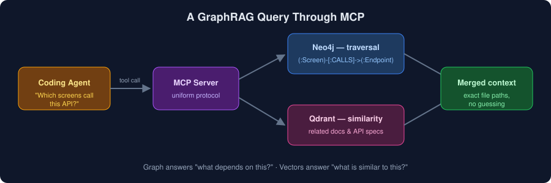

# Chapter 6 — Parsing & Integration: Tree-sitter & MCP

> [◀ Chapter 5](05-storage-neo4j-qdrant.md) · [🏠 Home](../README.md) · [Chapter 7 ▶](07-ai-coding-agents.md)

---

Two pieces of plumbing make the whole system work: **Tree-sitter** gets knowledge *out of code*, and the **Model Context Protocol (MCP)** gets knowledge *into agents*.

## 6.1 Tree-sitter — Code Into Structure

- **Repository:** [github.com/tree-sitter/tree-sitter](https://github.com/tree-sitter/tree-sitter)
- **Docs:** [tree-sitter.github.io](https://tree-sitter.github.io/tree-sitter/)

[Tree-sitter](https://github.com/tree-sitter/tree-sitter) is an incremental parser generator. It turns source code into a concrete syntax tree (AST) fast enough to run on every keystroke — which is why editors like Neovim, Zed, and GitHub's own code navigation use it.

### Pipeline

```
Code → AST → Entities (classes, functions) → Relationships (calls, imports) → Graph
```

### Language Coverage for a Cross-Stack Brain

Tree-sitter has grammars for essentially every mainstream language. For the stacks this library targets:

| Language | Stack |
|----------|-------|
| Dart | Flutter |
| Java / Kotlin | Spring Boot, Android |
| Swift | iOS |
| PHP | Laravel |
| TypeScript / JavaScript | Web frontends, Node |
| SQL | Schemas & migrations |

Because parsing is **local and deterministic**, tools like [Graphify](https://github.com/safishamsi/graphify) can extract code entities with zero API calls — no tokens spent, no code leaving your machine.

## 6.2 MCP — The Model Context Protocol

- **Website:** [modelcontextprotocol.io](https://modelcontextprotocol.io)
- **Spec & SDKs:** [github.com/modelcontextprotocol](https://github.com/modelcontextprotocol)

MCP is an open standard (introduced by [Anthropic](https://www.anthropic.com), now broadly adopted) that lets AI agents call external tools through a uniform protocol — "USB-C for AI tools."

### What MCP Connects

An MCP server can expose:

- **[Neo4j](https://neo4j.com)** — graph queries ([official MCP server](https://github.com/neo4j-contrib/mcp-neo4j))
- **[Qdrant](https://qdrant.tech)** — vector search ([official MCP server](https://github.com/qdrant/mcp-server-qdrant))
- **Filesystem & Git** — repository access
- **GitHub, Jira, databases** — organizational context

### The Flow

```
LLM → MCP client → MCP server → Tool (Neo4j / Qdrant / Git) → Response → LLM
```

The agent doesn't need bespoke integration code per tool. Any MCP-capable agent — [Claude Code](https://claude.com/claude-code), [Cursor](https://cursor.com), [Gemini CLI](https://github.com/google-gemini/gemini-cli), and others — can query your knowledge graph the moment you point it at the server.

## 6.3 Putting It Together

<p align="center">
  
</p>

1. **Ingestion time:** Tree-sitter parses code → Graphify extracts entities → Neo4j & Qdrant store them.
2. **Query time:** the agent calls MCP tools → graph traversal + vector search run → merged results return as context.

With the plumbing done, the last question is which agent to put on top — that's [Chapter 7](07-ai-coding-agents.md).

---

> [◀ Chapter 5: The Storage Layer](05-storage-neo4j-qdrant.md) · [🏠 Home](../README.md) · [Chapter 7: AI Coding Agents ▶](07-ai-coding-agents.md)
