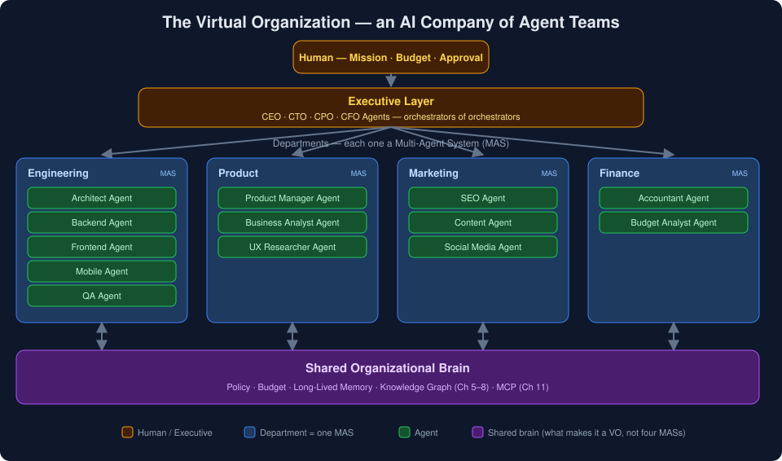

> [◀ Chapter 14](14-multi-agent-systems.md) · [🏠 Home](../README.md) · [Chapter 16: Spec-Driven Development ▶](16-spec-driven-development.md)

---

# Chapter 15 — Virtual Organizations: From Agent Teams to AI Companies

> *"A multi-agent system is a team. A virtual organization is the company that team works for — with policies, budgets, memory, and a reason to exist beyond the current task."*

---

# 15.1 Introduction

[Chapter 14](14-multi-agent-systems.md) ended one level too low.

It showed how to build a *team* of agents — a planner, coders, a reviewer, a tester — coordinated to finish a task. That is a multi-agent system (MAS), and for most work it is the ceiling of what you need. But follow the ambition past a single team — an AI that behaves less like a task-runner and more like a *company* — and a MAS is no longer the whole system. It becomes one department inside something larger.

That larger thing is a **Virtual Organization (VO)**.

The distinction is the entire subject of this chapter, and it is easy to state:

> A MAS answers *"how do multiple agents cooperate to complete a task?"*
> A VO answers *"how is the entire AI organization structured, governed, and kept coherent over time?"*

MAS is the execution team. VO is the company. This chapter is the most forward-looking in the book — closer to frontier research ([§15.13](#1513-references)) than to shipping infrastructure — so read it as *vision grounded in the MAS mechanics of Chapter 14*, not as a build guide for next week.

---

# 15.2 The Difference Between a MAS and a VO

The two are often conflated because both involve "many agents." They operate at different levels of abstraction, and confusing them is the same category error as confusing a *team* with a *company*.

| Dimension | Multi-Agent System (MAS) | Virtual Organization (VO) |
|-----------|--------------------------|---------------------------|
| **Scope** | One goal / task | An ongoing mission |
| **Question** | How do agents cooperate? | How is the whole system governed? |
| **Lifetime** | Spun up, runs, dissolves | Persistent across many tasks |
| **Unit** | Individual agents | Departments (each a MAS) |
| **Coordination** | Handoffs between agents | Policy, budgets, reporting between teams |
| **Memory** | Task-scoped context | Organization-wide, long-lived |
| **Analogy** | A project team | The company the team belongs to |

The load-bearing row is **lifetime**. A MAS is ephemeral — it exists to finish a task and then it is gone. A VO *persists*: it carries policy, memory, and accumulated decisions from one task to the next, across teams that never directly met. That persistence is what turns a pile of agent teams into an organization.

---

# 15.3 Anatomy of a Virtual Organization

A VO is a nested structure. Agents compose into teams (each a MAS); teams compose into departments; departments compose into the organization.

```text
Virtual Organization
│
├── Engineering Department        ── MAS
│     ├── Architect Agent
│     ├── Backend Agent
│     ├── Frontend Agent
│     ├── Mobile Agent
│     └── QA Agent
│
├── Product Department            ── MAS
│     ├── Product Manager Agent
│     ├── Business Analyst Agent
│     └── UX Researcher Agent
│
├── Marketing Department          ── MAS
│     ├── SEO Agent
│     ├── Content Agent
│     └── Social Media Agent
│
└── Finance Department            ── MAS
      ├── Accountant Agent
      └── Budget Analyst Agent
```

Each department is a full multi-agent system in its own right, with its own orchestrator, its own bounded context, and its own tools ([Chapter 14 §14.5](14-multi-agent-systems.md#145-what-counts-as-a-multi-agent-system)). What makes them a *single organization* rather than four unrelated systems is the layer above them: shared policy, shared memory, a budget, and a reason to coordinate.

<p align="center">
  
</p>

This is the recursion the whole book has been building toward. Chapter 14's lesson — *give each responsibility a bounded context and a clear contract* — applies again, one level up: a department is just a "responsibility" with a bigger boundary.

---

# 15.4 The Microsoft Analogy

The intuition most people already have:

```text
Microsoft                    →   Virtual Organization
  ├── Windows team           →     one MAS
  ├── Azure team             →     another MAS
  └── Office team            →     another MAS
```

Each team is many people (agents) working together. But the *company* is more than the sum of its teams — it has executives, policies, budgets, reporting lines, and a strategy that outlives any single project. Remove that layer and you don't have Microsoft; you have three startups that happen to share a logo.

As with the [monolith→microservices analogy in Chapter 14](14-multi-agent-systems.md#144-the-monolith--microservices-analogy), keep this one for its intuition and drop it at its limits. A real company's coordination runs on human judgment, informal trust, and accountability that a VO has to *manufacture* explicitly out of policies and memory. The analogy tells you what a VO is *shaped* like; it does not tell you the shape is easy to build.

---

# 15.5 What a VO Adds That a MAS Doesn't

If a MAS already coordinates agents, what does the organizational layer contribute? Five things — and each is a governance function, not an execution one.

| Function | What it does | Without it |
|----------|--------------|------------|
| **Policy** | Standing rules every department must obey (security, style, compliance, tone) | Each MAS re-invents its own rules; they conflict |
| **Budget** | Allocates the token/cost ceiling ([Ch 14 §14.8](14-multi-agent-systems.md#148-parallel-execution-and-the-cost-multiplier)) across departments | One runaway department starves the rest |
| **Memory** | Organization-wide, long-lived knowledge ([Chapters 5–8](05-knowledge-graphs.md)) | Teams repeat each other's work and mistakes |
| **Reporting** | Structured status flowing up; direction flowing down | The top can't steer; departments drift |
| **Strategy** | A mission that outlives any single task | The VO is just a MAS with extra latency |

The pattern: **a MAS optimizes for finishing a task; a VO optimizes for staying coherent across many tasks over time.** The moment your system needs to remember decisions, enforce rules, and allocate a shared budget across independent teams, you have crossed from MAS into VO whether you named it or not.

---

# 15.6 Inter-Department Communication

Chapter 14's hardest problem — the [lossy handoff](14-multi-agent-systems.md#147-communication-between-agents) — returns here, amplified. Inside a MAS, agents hand off to each other. Inside a VO, *departments* hand off to each other, and the payloads are larger and further apart.

```text
Product Dept ──[spec + acceptance criteria]──▶ Engineering Dept
Engineering Dept ──[shipped feature + changelog]──▶ Marketing Dept
Finance Dept ──[budget ceiling]──▶ every department
```

Two mechanisms, mirroring [Chapter 14 §14.7](14-multi-agent-systems.md#147-communication-between-agents) one level up:

* **Contracts (message passing).** A department exposes a defined interface — Product emits specs in a fixed shape; Engineering emits changelogs. Clean and auditable, but whatever isn't in the contract is lost across the boundary.
* **Shared organizational memory (the blackboard).** Departments read and write a common brain — the knowledge graph and temporal memory of [Chapters 5–8](05-knowledge-graphs.md). Nothing is lost, but the brain needs a strict write discipline or it becomes organization-wide context pollution.

Every department boundary is another place natural language distorts intent. A VO with five departments has more internal interfaces than a MAS with five agents — which is exactly why *fewer, larger* departments usually beat *many, thin* ones.

---

# 15.7 The Executive Layer

Between the top-level goal and the departments sits a control plane — the agents that play executive roles.

```text
                Human (mission + approval + budget)
                          │
                    ┌─────┴─────┐
                    │  CEO Agent │        ← decomposes mission into department goals
                    └─────┬─────┘
              ┌───────────┼───────────┐
              ▼           ▼           ▼
          CTO Agent   CPO Agent   CFO Agent      ← department heads
              │           │           │
        Engineering   Product     Finance         ← each a MAS (§15.3)
            MAS          MAS         MAS
```

This is [Chapter 14's orchestrator–worker pattern](14-multi-agent-systems.md#146-orchestration-patterns) applied recursively: the CEO agent orchestrates department-head agents, each of which orchestrates its own team. It is orchestrators of orchestrators — the hierarchical pattern taken to its organizational conclusion.

The executive layer is also where **the human belongs** ([Chapter 14 §14.10](14-multi-agent-systems.md#1410-human-in-the-loop)). One approval at the CEO-agent boundary — *approve this mission, set this budget, authorize this launch* — steers every department beneath it. That is the highest-leverage seat in the whole system, and it is the one seat that should almost never be fully automated.

---

# 15.8 Organizational Memory

A MAS can get away with task-scoped memory; a VO cannot. The organization's entire value is that it *remembers* — decisions, policies, prior work, who-did-what — across tasks and teams that never overlapped in time.

This is precisely the problem [Chapter 8's temporal memory](08-graphiti.md) and [Chapters 5–6's knowledge graph](05-knowledge-graphs.md) were built to solve, now load-bearing rather than optional:

* **The knowledge graph** is the org chart, the dependencies, and the shared facts — *what exists and how it connects.*
* **Temporal memory** is the history — *what changed, when, and why* — so a decision made by the Product department in one quarter is visible to Engineering in the next.
* **Policy** lives as durable, retrievable facts every department reads before acting.

> A Virtual Organization without a shared brain is not an organization. It is several multi-agent systems talking past each other, re-deriving the same context and repeating the same mistakes — the failure mode of Chapter 14, multiplied by the number of departments.

This is the payoff of the entire book. Every piece of infrastructure in Parts I–III — graphs, vectors, temporal memory, MCP — exists so that an organization of agents can share one coherent brain instead of many disconnected ones.

---

# 15.9 When NOT to Build a Virtual Organization

This is the section that keeps the vision honest, and it is blunt: **almost no one needs a VO yet.**

A MAS can and usually should exist entirely on its own:

```text
User
  │
Planner
  ├── Researcher
  ├── Coder
  ├── Tester
  └── Reviewer
```

That is a complete, valid, useful system with no organizational layer at all. Reach for a VO *only* when every one of these is true:

* **Multiple persistent workstreams.** You have genuinely distinct, ongoing functions (engineering *and* product *and* marketing), not one task wearing several hats.
* **Cross-team memory is essential.** Departments must build on each other's decisions over time, not just pass a single payload.
* **The mission outlives the task.** The system exists to pursue an ongoing goal, not to finish and dissolve.
* **The budget justifies it.** A VO multiplies Chapter 14's ~15× token cost across *every department*. The mission's value has to clear that.

If any of these is false, you want a MAS — or a single agent. Building a VO for a task that a MAS would finish is org-chart cosplay: all the latency, cost, and lossy handoffs of a company, to do the work of a team.

> The right question is never "how do I build an AI company?" It is **"what is the smallest structure that keeps this coherent?"** For most projects, the honest answer is one MAS — or one agent.

---

# 15.10 Failure Modes at Organizational Scale

Everything that can go wrong in a MAS ([Chapter 14 §14.3](14-multi-agent-systems.md#143-why-single-agents-break-down)) can go wrong in a VO, plus failures that only exist at organizational scale:

| Failure | What it looks like |
|---------|--------------------|
| **Goal drift** | Departments optimize local objectives; the mission fragments |
| **Policy conflict** | Two departments follow rules that contradict each other |
| **Budget starvation** | One department consumes the token ceiling; others stall |
| **Memory rot** | The shared brain fills with stale or contradictory facts; every read is poisoned |
| **Handoff decay** | Intent degrades a little at each department boundary until the output no longer matches the mission |
| **Coordination overhead exceeds output** | The VO spends more effort coordinating than producing — the org-scale version of premature decomposition |

The design rule scales up from Chapter 14 unchanged: **make failures cheap to contain.** Bounded departments with clear contracts fail in bounded, recoverable pieces. A tangled VO with implicit cross-department dependencies fails as a whole — and debugging a failed organization is far harder than debugging a failed team.

---

# 15.11 The Maturity Ladder

This chapter completes a progression the book has traced since [Chapter 2](02-evolution-of-ai-software-engineering.md). Each rung is not a replacement for the one below it but a structure built *on top* of it — and each is the right stopping point for a large share of real systems.

```text
Prompt
  ↓
Prompt Engineering
  ↓
Single AI Agent
  ↓
Agentic Workflow / Loop
  ↓
Multi-Agent System        ← Chapter 14: the team
  ↓
Virtual Organization      ← Chapter 15: the company
  ↓
Autonomous AI Companies   ← the frontier
```

The mistake at every rung is the same: climbing higher than the task requires. Most work stops at *single agent* or *agentic loop*. Some genuinely needs a MAS. A rare few — persistent, multi-functional, mission-driven — justify a VO. The skill this book has argued for throughout is not building the tallest structure. It is **knowing which rung the task actually needs, and stopping there.**

---

# 15.12 Key Takeaways

| Idea | Summary |
|------|---------|
| The distinction | MAS = the execution team ("how do agents cooperate?"); VO = the company ("how is the whole system governed?") |
| The load-bearing difference | Lifetime — a MAS is ephemeral; a VO *persists* policy, memory, and budget across tasks |
| The structure | Agents → teams (MAS) → departments → organization; the same "bounded context + contract" rule, recursed upward |
| What a VO adds | Governance, not execution: policy, budget, org-wide memory, reporting, strategy |
| The dependency | A VO without a shared brain (Ch 5–8) is just several MASs talking past each other |
| The hard part | Inter-department handoffs — Chapter 14's lossy-handoff problem, amplified by larger, further-apart payloads |
| The discipline | Reach for one MAS — or one agent — first; a VO multiplies the ~15× token cost across every department |
| The through-line | Don't build the tallest structure; build the smallest one that stays coherent |

---

# 15.13 References

* Qian et al., *[Communicative Agents for Software Development (ChatDev)](https://arxiv.org/abs/2307.07924)* (2023) — agents playing CEO, CTO, programmer, reviewer to build software
* Hong et al., *[MetaGPT: Meta Programming for a Multi-Agent Collaborative Framework](https://arxiv.org/abs/2308.00352)* (2023) — encodes standard operating procedures and org roles into a multi-agent system
* Park et al., *[Generative Agents: Interactive Simulacra of Human Behavior](https://arxiv.org/abs/2304.03442)* (2023) — emergent coordination among many persistent agents
* Microsoft, *[AutoGen](https://github.com/microsoft/autogen)* — a framework for multi-agent conversation and orchestration
* Anthropic, *[How we built our multi-agent research system](https://www.anthropic.com/engineering/multi-agent-research-system)* (2025)

---

### Author's Note

This is the book's most speculative chapter, and deliberately so. Frameworks like ChatDev and MetaGPT show the shape of an AI organization is buildable today; whether it is *worth* building for any given goal is almost always "not yet." The value of the concept is not that you should build a VO — it is that it names the ceiling, and shows that every rung below it ([single agent](02-evolution-of-ai-software-engineering.md), [MAS](14-multi-agent-systems.md), the [compound-engineering loop](13-compound-engineering.md)) is a legitimate place to stop. The engineering judgment this whole library argues for is choosing the lowest rung that works — and having read this far, you now know what the top of the ladder looks like when you decide not to climb it.

---

**End of Chapter 15**

---

> [◀ Chapter 14: Multi-Agent Systems](14-multi-agent-systems.md) · [🏠 Home](../README.md) · [Chapter 16: Spec-Driven Development ▶](16-spec-driven-development.md)
