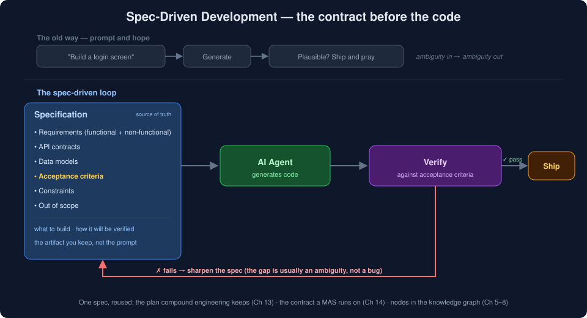

> [◀ Chapter 15](15-virtual-organizations.md) · [🏠 Home](../README.md) · [Chapter 17 ▶](17-git-worktrees.md)

---

# Chapter 16 — Spec-Driven Development: The Contract Before the Code

> *"When generating code costs seconds, the specification becomes the source code. The prompt is a throwaway; the spec is the artifact you keep."*

---

# 16.1 Introduction

[Chapter 3](03-prompt-to-knowledge-engineering.md#37-spec-driven-development) introduced spec-driven development as one layer in the progression from prompting to knowledge engineering. This chapter gives it the full treatment it earns, because as generation gets cheaper, *specifying* becomes the scarce skill.

Consider the difference between two requests to an AI agent:

```text
"Build a login screen."
```

versus

```text
Feature: Email + password login
  - POST /auth/login accepts {email, password}
  - Returns 200 + JWT (15-min expiry) on success
  - Returns 401 on bad credentials; never reveal which field was wrong
  - Rate-limit: 5 attempts / 15 min per IP
  - Password: bcrypt, cost 12
  - Out of scope: OAuth, "remember me", password reset
  Acceptance: the 6 cases in auth_login_spec are green
```

The first is a wish. The second is a **contract**. The same model, given the second, produces something you can actually verify — because the request already says what "correct" means. Spec-driven development is the discipline of writing the second kind, every time, and treating that spec — not the prompt, and increasingly not even the code — as the primary artifact.

This is the same shift [Chapter 13](13-compound-engineering.md) named from the other direction: once writing code is cheap, the work moves to *knowing what to build and whether it was built right*. A specification is how you write that knowledge down.

---

# 16.2 Why Prompts Alone Don't Scale

A prompt is a fine way to *start*. It fails as the thing you *build on*, for reasons that get worse — not better — as models improve.

* **A prompt is ephemeral.** It is typed, used, and lost. The next task starts from nothing, and the reasoning that produced good output is gone.
* **A prompt is underspecified.** "Build a login screen" leaves a hundred decisions to the model — token expiry, error messages, rate limits. The model will make all of them, silently, and differently each time.
* **A prompt is not reviewable.** You cannot diff two prompts and see what changed about the *intended behavior*. You can only diff the outputs, after the fact.
* **A more capable model makes this worse, not better.** A stronger model fills ambiguity more confidently and more plausibly — which means the gap between "looks right" and "is right" is *harder* to spot, not easier.

The failure mode has a name now — "vibe coding" — and it works right up until the thing it produced has to be correct, maintained, or handed to another agent. At that point the absence of a spec is the absence of a definition of done.

```text
Prompt-and-hope:   wish ──▶ generate ──▶ "looks right?" ──▶ ship 🤞
                          (ambiguity in → ambiguity out)

Spec-driven:       spec ──▶ generate ──▶ verify vs acceptance criteria ──▶ ship ✓
                          (definition of done, before the code exists)
```

---

# 16.3 What a Specification Actually Contains

A spec is not a novel. It is the minimum set of decisions that removes ambiguity from the task. In practice it answers seven questions:

| Element | The question it answers |
|---------|-------------------------|
| **Functional requirements** | What must it *do*? |
| **Non-functional requirements** | How fast / secure / available must it be? |
| **API contracts** | What are the exact inputs, outputs, and error shapes? |
| **Data models** | What entities and fields exist, and what are their invariants? |
| **Constraints** | What must the solution respect (stack, budget, compatibility)? |
| **Out of scope** | What must it explicitly *not* do? |
| **Acceptance criteria** | How will we know it is correct? |

The two most-skipped elements are the two most valuable. **Out of scope** stops an agent from confidently building the wrong thing — it is the cheapest bug prevention there is. And **acceptance criteria** are the difference between a spec and a wish, which is the whole of the next section.

---

# 16.4 The Spec-Driven Loop

Spec-driven development replaces the prompt-and-hope cycle with a loop that has a real exit condition:

```text
        ┌──────────────────────────────────────────┐
        │                                          │
        ▼                                          │  ✗ fails → refine the spec
  Specification ──▶ AI agent generates ──▶ Verify against ──┐
  (source of truth)      code            acceptance criteria │
        ▲                                          │        │
        │                                          └────────┘
        └───────────────── ✓ passes → ship ────────────────▶
```

The critical property is that **the loop closes against the spec, not against a human's gut feeling.** When verification fails, the fix is often not to re-prompt but to *sharpen the spec* — the failure usually exposes an ambiguity the spec left open. Over time the spec accretes precision, and — per [compound engineering](13-compound-engineering.md) — that precision is reusable: the spec for "auth" is the starting point for the next auth-shaped feature.

<p align="center">
  
</p>

---

# 16.5 Acceptance Criteria: The Part That Matters Most

A specification without acceptance criteria is just a more detailed wish. The acceptance criteria are what make it *executable knowledge* — they encode the definition of "done" in a form that can be checked without a human re-reading the whole spec.

This is the same insight that made **test-driven development** work, one level up: in TDD you write the failing test first; in spec-driven development you write the *acceptance criteria* first, and they frequently *become* the tests. The lineage is direct — spec-driven development is TDD's discipline applied to the intent an agent works from, not just the code a human writes.

Good acceptance criteria are **concrete and adversarial**:

* Concrete: *"Returns 401 on bad credentials"* — not *"handles errors gracefully."*
* Adversarial: they name the failure cases, the edge inputs, and the things that must *not* happen (the out-of-scope leaks).

This is where spec-driven development pays back the [review discipline of Chapter 13](13-compound-engineering.md#133-the-four-step-loop): verification stops being a subjective *"does this look plausible?"* and becomes an objective *"does it satisfy criterion 4?"* — which is exactly the check an agent, or another agent, can run unattended.

---

# 16.6 Specifications as Knowledge

Chapter 3 sketched this idea; here is why it matters for the rest of the book. A spec is usually treated as a document, but it is really a set of **relationships**, and relationships are graph-shaped ([Chapters 5–6](05-knowledge-graphs.md)):

```text
Authentication Feature
   │ HAS_REQUIREMENT
   ▼
JWT Authentication
   │ IMPLEMENTED_BY
   ▼
AuthService
   │ TESTED_BY
   ▼
AuthIntegrationTests
   │ VERIFIES
   ▼
Acceptance Criteria #4
```

Modeled this way, a specification stops being a static file and becomes a queryable, living artifact:

* *"Which acceptance criterion is this code path supposed to satisfy?"*
* *"If this requirement changes, what implementation and tests are downstream?"*
* *"Which features have requirements with no verifying test?"*

This is the traceability that [Graphify and the knowledge graph](07-graphify.md) exist to provide, now pointing at *intent* rather than just code. A spec-as-graph is the connective tissue between what was asked for, what was built, and what was verified.

---

# 16.7 Spec-Driven Development in Practice

The discipline is old; the tooling is new. Requirements engineering, design-by-contract, and TDD are its ancestors. What is new in 2025–2026 is tooling built specifically to make a *specification the primary input to an AI agent* — and this space is moving fast, so treat the names as a snapshot, not a standard.

* **GitHub Spec Kit** — an open-source toolkit for spec-driven development with coding agents: you write a structured spec, and it drives generation and iteration from that spec rather than from ad-hoc prompts.
* **AWS Kiro** — an agentic IDE built around the spec-first flow: requirements → design → tasks → code, with the spec as the durable artifact.
* **Tessl and similar "spec-centric" efforts** — betting that the spec, not the code, becomes the thing humans maintain, with code treated as a compiled output.

The through-line across all of them: the human's leverage moves *up*, from writing implementation to authoring and reviewing the specification the agent compiles.

---

# 16.8 When NOT to Spec-Drive

Writing a full spec is itself work, and sometimes it costs more than the code it governs. Reach for a prompt — not a spec — when:

* **The work is throwaway or exploratory.** A one-off script, a spike, a "does this API even return what I think?" probe. Specifying it is pure overhead.
* **You are still discovering the requirements.** If you genuinely don't know what you want yet, a spec written now is fiction. Prototype first, *then* spec what you decide to keep.
* **The task is trivial and self-verifying.** A rename, a one-line fix, a format change. The code *is* the spec.
* **The spec would just restate the code.** If the specification is not meaningfully shorter or more stable than the implementation, it earns nothing.

> The rule mirrors the rest of this book: spec-drive when the intent is **non-obvious, reused, or verified by someone other than its author** — which now includes AI agents. Otherwise a prompt is the right tool, and a spec is ceremony.

---

# 16.9 How Spec-Driven Development Feeds the Rest of the Book

Spec-driven development is not a standalone technique; it is the *input format* the other disciplines assume exists. One well-written spec is reused four ways:

| The spec becomes… | …in |
|-------------------|-----|
| The **plan** worth keeping, not a throwaway prompt | [Compound Engineering (Ch 13)](13-compound-engineering.md) |
| The **contract** each agent works against — the handoff that isn't lossy | [Multi-Agent Systems (Ch 14)](14-multi-agent-systems.md) |
| The **brief** a department turns into work | [Virtual Organizations (Ch 15)](15-virtual-organizations.md) |
| A set of **nodes** linking intent → implementation → verification | [Knowledge Graphs (Ch 5–8)](05-knowledge-graphs.md) |

This is why the chapter sits in *Practices* rather than *Technologies*: it requires none of the stack, but it is the discipline that gives everything else something worth acting on. A [MAS](14-multi-agent-systems.md) whose agents share no spec is a room of confident guesses; the spec is the shared definition of done that lets bounded agents — or bounded departments — actually agree on what "done" means.

---

# 16.10 Key Takeaways

| Idea | Summary |
|------|---------|
| The shift | When generation is cheap, the **specification** is the artifact you keep — the prompt is disposable |
| Why prompts don't scale | Ephemeral, underspecified, unreviewable — and a stronger model fills ambiguity *more* convincingly |
| What a spec contains | Requirements, contracts, data models, constraints, **out-of-scope**, and **acceptance criteria** |
| The loop | Spec → generate → verify against acceptance criteria → pass ships / fail refines the *spec* |
| The heart of it | Acceptance criteria turn review from "looks plausible?" into "satisfies criterion 4?" — TDD, one level up |
| As knowledge | A spec is relationships (requirement → implementation → test) — a queryable graph, not a static doc |
| When not to | Throwaway, exploratory, trivial, or when the spec just restates the code |
| The connection | The spec is the reusable input compound engineering keeps, MAS agents contract against, and VO departments run on |

---

# 16.11 References

* Beck, *Test-Driven Development: By Example* (2002) — the discipline's direct ancestor
* GitHub, *[Spec Kit](https://github.com/github/spec-kit)* — open-source spec-driven development toolkit for coding agents
* AWS, *[Kiro](https://kiro.dev)* — an agentic IDE built around the spec-first flow
* Thoughtworks, *Technology Radar* — spec-driven development entries
* Meyer, *Object-Oriented Software Construction* (1997) — design by contract, a conceptual forebear

---

### Author's Note

Spec-driven development is the least novel idea in this book and possibly the most important. Nothing in it requires a knowledge graph, an agent, or an organization — it is just the old discipline of saying precisely what you want before you build it. What changed is the economics: when a human wrote every line, an imprecise spec cost a little rework; when an agent writes it in seconds and another agent reviews it, the spec is the only place intent lives. Read alongside [Chapter 13](13-compound-engineering.md), the message is the same from a different angle — the scarce skill is no longer writing code, it is defining, precisely, what correct means.

---

**End of Chapter 16**

---

> [◀ Chapter 15: Virtual Organizations](15-virtual-organizations.md) · [🏠 Home](../README.md) · [Chapter 17: Git Worktrees ▶](17-git-worktrees.md)
