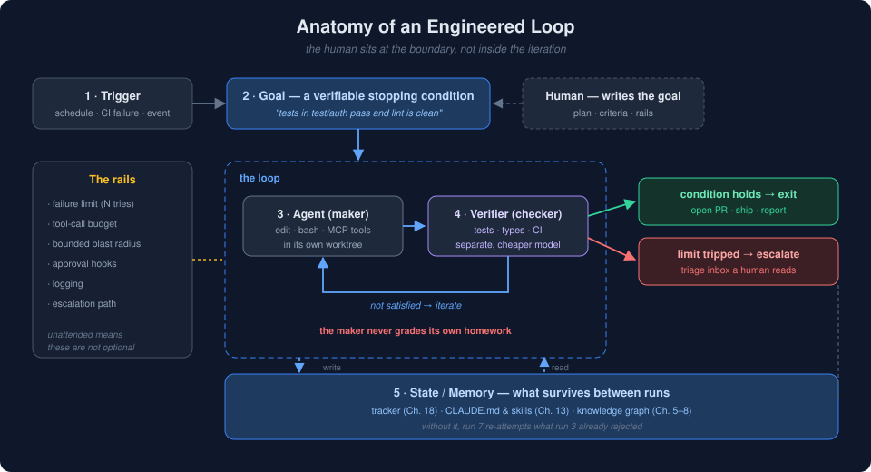

> [◀ Chapter 18](18-sprint-tracking.md) · [🏠 Home](../README.md) · [Chapter 20: Graph Engineering & Long-Context Models ▶](20-graph-engineering-long-context.md)

---

# Chapter 19 — Loop Engineering: Designing the System That Prompts the Agent

> *"I don't prompt Claude anymore. I have loops running that prompt Claude and figuring out what to do. My job is to write loops."*
> — Boris Cherny, head of Claude Code, June 2026

---

# 19.1 Introduction

For roughly two years the skill was this: write a good prompt, read what came back, write the next one. You held the tool the entire time. Every improvement in agent capability made your turns more productive — and left the *number of turns you personally had to take* exactly where it was.

In June 2026 that assumption broke in public. Peter Steinberger wrote that *"you shouldn't be prompting coding agents anymore — you should be designing loops that prompt your agents."* Boris Cherny, who runs Claude Code, said the quiet part plainly: his job had become writing loops. Addy Osmani gave the pattern a name and an architecture, and within a week **loop engineering** had a definition, a set of components, and the usual accompanying wave of overclaiming.

The underlying observation is not about model quality. It is about **where the human sits**.

```text
Prompt engineering:   human ──▶ agent ──▶ human ──▶ agent ──▶ human ...
                      (you are inside every iteration)

Loop engineering:     human ──▶ [ loop: agent ⇄ verifier ⇄ state ] ──▶ human
                      (you are at the boundary, not inside)
```

This chapter argues that loop engineering is not a new methodology so much as **the logical endpoint of [Chapter 13's compound-engineering loop](13-compound-engineering.md)** — the same four steps, with the human deliberately relocated from inside each iteration to the loop's edges. It also argues that a loop is only as good as the memory and the verification you give it, which is precisely what the rest of this book has been building.

---

# 19.2 The Third Layer

[Chapter 3](03-prompt-to-knowledge-engineering.md) framed prompt engineering, context engineering, and knowledge engineering as **accumulating layers** rather than replacements. Loop engineering is the next one, and it accumulates the same way.

| Layer | The question it answers | The unit of work | What it optimizes |
|---|---|---|---|
| **Prompt engineering** | *What do I say?* | One message | Phrasing, examples, format |
| **Context engineering** | *What does it need to know right now?* | One session | Retrieval, window budget, tool results |
| **Knowledge engineering** | *What should it know permanently?* | The project | Graphs, specs, `CLAUDE.md`, solution docs |
| **Loop engineering** | *What system asks, and when does it stop?* | The workflow | Triggers, verification, state, stopping conditions |

Each layer assumes the ones below it. A loop wrapped around an agent with no persistent knowledge does not become autonomous — it becomes an efficient way to re-derive the same context twenty times and get twenty slightly different answers. **Loops amplify whatever is underneath them, including the gaps.**

That is the single most important claim in this chapter, and it is why loop engineering appears at Chapter 19 rather than Chapter 4.

---

# 19.3 Anatomy of a Loop

Strip away tooling and every working loop has the same five parts.

<p align="center">
  
</p>

| Part | What it is | The failure if you skip it |
|---|---|---|
| **Trigger** | What starts a run: a schedule, a webhook, a CI failure, a merged PR, another loop finishing | The loop is a script you still have to remember to run |
| **Goal** | A **verifiable** end state — *"all tests in `test/auth` pass and lint is clean"* — not *"improve auth"* | The loop cannot tell whether it is done, so it stops when the model feels finished |
| **Actions** | The tool surface: file edits, bash, MCP servers, HTTP, sub-agents | The agent can reason but not change anything; you get advice, not work |
| **Verification** | A check the agent does not control: tests, CI, a type checker, a separate reviewer model | The loop grades its own homework and always passes |
| **Memory** | State that survives the run: a markdown file, a tracker, a board, a graph | Every run starts from zero and re-litigates decisions already made |

The two that teams actually get wrong are **Goal** and **Verification** — and they fail in opposite directions. A vague goal produces a loop that never terminates; a self-graded verification produces a loop that terminates immediately and confidently, having done nothing.

## The exit condition is the design

Notice what the goal field is: it is an **acceptance criterion**. That is not a coincidence or an analogy. It is the same artifact [Chapter 16](16-spec-driven-development.md) argued you should be writing anyway:

> *"The critical property is that the loop closes against the spec, not against a human's gut feeling."* — [§16.4](16-spec-driven-development.md#164-the-spec-driven-loop)

Spec-driven development said acceptance criteria make review objective. Loop engineering makes the same criteria **load-bearing**: without them the loop has no exit, and a loop with no exit is not automation, it is a bill. A team that cannot write acceptance criteria cannot build loops, and should fix that first.

---

# 19.4 The Five Components

Osmani's architecture names five pieces that turn a one-shot agent run into something that runs on its own. Four of the five already have chapters in this book — which is the strongest evidence that loop engineering is a synthesis rather than an invention.

## 1. Automations — the heartbeat

A schedule or an event that starts the loop without you. Nightly triage, on-merge documentation, on-CI-failure diagnosis. This is the part that makes a loop *cyclical* rather than a thing you run manually and call a loop.

The discipline here is choosing triggers tied to **real events in the work**, not to the clock for its own sake. "Every morning at 08:00, read yesterday's CI failures" is a trigger. "Every 15 minutes, look for something to do" is a way to spend money.

## 2. Worktrees — parallelism without collisions

Isolated working directories so concurrent agents do not edit the same files. This is [Chapter 17](17-git-worktrees.md) in its entirety, and the rule from [§17.5](17-git-worktrees.md#175-the-agent-per-worktree-pattern) carries over unchanged:

> One agent → one worktree → one branch → one PR.

Loops make this non-negotiable rather than merely advisable. A human running two agents in one folder notices the collision. An unattended loop running four of them at 03:00 does not, and you find out from the diff.

## 3. Skills — so you stop explaining your project every run

Codified project knowledge in files the agent reads every session: conventions, build steps, the constraint that exists because of one incident nobody wants to repeat. Osmani calls the absence of this **intent debt** — the agent "will fill any hole in your intent with a confident guess."

This is `CLAUDE.md` and solution documents from [§13.5](13-compound-engineering.md#135-essential-artifacts), promoted from *good hygiene* to *loop infrastructure*. In a supervised session, a wrong guess costs you one correction. In a loop, the same wrong guess is applied silently across every run until someone reads the output.

## 4. Plugins and connectors — the loop touches real tools

MCP servers and integrations linking the agent to issue trackers, databases, CI, Slack, and the knowledge graph itself ([Chapter 11](11-mcp-and-ai-agents.md)). The distinction is between a loop that *recommends* opening a PR and one that opens it.

This is also where the blast radius lives. Every connector you add is both a capability and a way for a bad run to reach production. Connectors deserve the same scrutiny as database credentials, because functionally that is what they are.

## 5. Sub-agents — keep the maker away from the checker

One agent explores and implements; a **different** one verifies. Osmani's justification is blunt and correct: a model is *"way too nice grading its own homework."*

This is the [debate/critic pattern from §14.6](14-multi-agent-systems.md#146-orchestration-patterns) with a specific job. Note what it is *not*: it is not a second opinion for quality's sake, it is the loop's **termination authority**. The verifier decides whether the loop stops.

## The sixth component: state

Osmani lists five and then describes a sixth throughout — external memory, because *"the model forgets everything between runs."* A markdown file, a Linear board, a tracker.

This book has an opinionated answer to that: it is [Chapter 18's tracker](18-sprint-tracking.md), and at scale it is the knowledge graph of Part II. The tracker was designed for a human writing history; a loop needs the same file for a different reason — to know what it already tried, so run 7 does not re-attempt what run 3 rejected.

```text
Component        This book's chapter
──────────       ──────────────────────────────────────
Automations   →  (new — §19.4)
Worktrees     →  Chapter 17
Skills        →  Chapter 13 (CLAUDE.md, solution docs)
Connectors    →  Chapter 11 (MCP)
Sub-agents    →  Chapter 14 (orchestration, critic loops)
State         →  Chapter 18 (tracker) + Chapters 5–8 (graph)
```

---

# 19.5 Stopping Conditions Are the Hard Part

Osmani describes a `/goal` primitive — available in both Claude Code and Codex — where you state a condition and the agent keeps working across turns until it holds, with **a separate, smaller model** judging whether it holds.

Three properties make that design work, and all three are worth stealing regardless of tooling:

1. **The condition is machine-checkable.** "Tests pass and lint is clean" can be evaluated. "The code is clean" cannot, and a loop pointed at it will either run forever or exit on vibes.
2. **The judge is not the worker.** Separation is what makes the exit trustworthy.
3. **The judge is cheaper than the worker.** Verification runs on every iteration; if it costs as much as the work, the loop's economics collapse.

## A hierarchy of stopping conditions

| Tier | Condition | Trustworthy? |
|---|---|---|
| **Best** | A command exits 0 — tests, type check, lint, build, benchmark threshold | Yes. Deterministic, cheap, auditable |
| **Good** | A verifier model checks output against written acceptance criteria | Mostly. Criteria quality is the ceiling |
| **Weak** | A verifier model checks against a prose description of "done" | Rarely. Reduces to taste |
| **Broken** | The working agent declares itself finished | No |
| **Also broken** | No condition; a fixed iteration count | No. That is a budget, not a goal — see below |

An iteration cap is not a stopping condition. It is a **failure limit**, and it belongs in the rails, not the goal.

---

# 19.6 The Rails

A loop running unattended is a loop making mistakes unattended. Every safety mechanism below exists because the human who used to catch that mistake at turn two is now asleep.

| Rail | What it does | Concrete form |
|---|---|---|
| **Failure limit** | Stops a loop that is not converging | *"After 10 iterations with no progress, escalate to human review"* |
| **Tool-call budget** | Caps spend per iteration; exhausting it *is a signal* | Budget per run; treat exhaustion as failure, not as "keep going" |
| **Blast radius** | Bounds what a bad run can reach | Worktree, scoped branch, no force-push, no prod credentials, PR not merge |
| **Approval gates** | Requires a human for irreversible steps | Hooks that intercept tool calls before execution; merges, deploys, deletions, outbound messages |
| **Logging** | Makes the run reconstructible afterward | Every action, every verification result, every stop reason — appended to state |
| **Escalation path** | Somewhere for the loop to *give up to* | A triage inbox a human actually reads |

Two of these deserve emphasis.

**Exhausting a budget without progress is a failure signal, not a reason to raise the budget.** A loop burning its allowance on the same file is telling you the task was underspecified. The fix is upstream, in the goal.

**The escalation path is the component teams forget.** A loop with no way to give up does one of two things: it invents a solution nobody asked for, or it silently stops and you discover the gap a week later. The triage inbox is the difference between a loop that fails safely and a loop that fails quietly.

---

# 19.7 Five Loop Patterns

Loops in practice fall into a small number of shapes. Naming them makes the design choice explicit — and, per the [maturity ladder in §15.11](15-virtual-organizations.md#1511-the-maturity-ladder), most work needs the lowest rung, not the tallest.

## 1. The goal loop

The simplest useful loop. One task, one machine-checkable condition, iterate until it holds or the failure limit trips.

```text
goal: "all tests in test/auth pass, lint clean, no new type errors"
  ├─ agent edits → runs suite → reads failures → edits again
  ├─ verifier (separate model) confirms condition
  └─ stop | escalate after N non-improving iterations
```

Best for well-bounded work with an existing test surface. This is where every team should start.

## 2. The triage loop

Scheduled discovery. Read the state of the world, decide what is actionable, act on the safe subset, and route the rest to a human.

```text
06:00 → read CI failures, new issues, dependency alerts
      → classify: auto-fixable | needs-spec | needs-human
      → auto-fixable  → spawn goal loops in worktrees → open PRs
      → everything else → triage inbox
```

The classification step is the whole design. A triage loop that classifies too aggressively becomes a PR firehose nobody reviews — which is a worse outcome than no loop, because it consumes the review capacity that made the loop safe.

## 3. The fan-out loop

One spec, N candidate implementations, one shared acceptance criterion, one decision. This is [§17.8's worktree fan-out](17-git-worktrees.md#178-fan-out--fan-in-comparing-implementations) with the comparison automated: the loop runs all N against the criteria and presents a ranked result.

Expensive, and genuinely useful for decisions where the trade-off is hard to reason about in the abstract — a data structure choice, a migration strategy, a rendering approach.

## 4. The ratchet loop

A loop whose goal is a **monotonic metric**, not a binary state: coverage never decreases, bundle size never grows, the type-error count only falls. Each run improves the number by some amount or does nothing.

The property that makes ratchets safe is that the verification is trivially checkable and the worst case is *no change*. The property that makes them dangerous is that metrics are proxies — a coverage ratchet with no review will eventually write tests that assert nothing.

## 5. The watchdog loop

Continuous observation with a narrow action set: detect drift, flag it, do not fix it. Documentation that contradicts code. Specs whose acceptance criteria no longer match the implementation. Graph nodes with no corresponding file after a refactor.

The cheapest loop to run, the easiest to trust, and the one most likely to survive contact with a skeptical team — because its blast radius is a notification.

---

# 19.8 Loop Engineering Is Compound Engineering With the Human Moved

[Chapter 13](13-compound-engineering.md) proposed an allocation: Plan 40% → Work 10% → Review 40% → Compound 10%, with a human present at every step. Loop engineering asks a sharper question of that same loop: **which of these four steps requires a human inside each iteration, and which only requires one at the boundary?**

| Step | Ch. 13 (supervised) | Ch. 19 (looped) | What made the move possible |
|---|---|---|---|
| **Plan** | Human, 40% | **Human, at the boundary** — and now the majority of the human's total time | Nothing. This is the irreducible part |
| **Work** | Agent, 10% | Agent, inside the loop | Already automated in Ch. 13 |
| **Review** | Human, 40% | **Verifier + tests inside the loop; human samples at the boundary** | Machine-checkable acceptance criteria (Ch. 16) + maker/checker split (Ch. 14) |
| **Compound** | Human, 10% | **The loop writes its own record** | The tracker declared in `AGENTS.md` (Ch. 18) |

Read the right-hand column top to bottom and you have the actual prerequisite list for loop engineering. It is not "a better agent." It is: *specs with exit conditions, a verifier that isn't the worker, isolated filesystems, and a state file that survives the session.* Every one of those has a chapter.

This reframing also predicts who succeeds with loops. Teams already doing compound engineering find loop engineering is mostly a packaging exercise. Teams that skipped the Compound step find that loops make their amnesia run faster and cost more — which is exactly the multiplicative failure [§13.6](13-compound-engineering.md#136-the-compound-equation) warned about:

```text
Productivity = Code Velocity × Feedback Quality × Iteration Frequency
                    ▲                 ▲                  ▲
                loops raise      loops do NOT      loops raise
                this a lot       raise this        this a lot
```

Loops multiply two of the three terms and leave the middle one entirely to you. If feedback quality is near zero, a loop is a machine for reaching the wrong place faster.

---

# 19.9 What the Loop Still Does Not Do For You

Osmani closes his post with the part most summaries drop, and it is the part worth keeping. Three debts accumulate silently.

**Unattended mistakes.** A verifier sub-agent reduces this; it does not eliminate it. Two models sharing a wrong assumption agree enthusiastically. The rails in §19.6 exist because verification is a filter, not a proof.

**Comprehension debt.** The faster a loop ships code you did not write, the larger the gap between what runs in production and what you actually understand. This debt is invisible until an incident, at which point it is due in full, at 03:00, with the loop unable to help because the problem is that nobody knows how the system works. This is the risk [Chapter 18](18-sprint-tracking.md) was written against — the decision log with its rejected alternatives is the interest payment that keeps the principal from growing.

**Cognitive surrender.** The subtlest one. Running loops feels productive, and that feeling is available whether or not you are still thinking. The same loop, built by two engineers, yields opposite outcomes: for one it is leverage on judgment they still exercise; for the other it is a way to stop exercising it. Osmani's framing is the right one — *your job is to ship code you confirmed works.* Loops provide velocity. They do not provide certainty, and they never provided understanding.

---

# 19.10 When NOT to Build a Loop

* **When you cannot state a machine-checkable exit condition.** No exit, no loop. Write the acceptance criteria first ([Chapter 16](16-spec-driven-development.md)); if you cannot, the task is not ready for automation at any level.
* **When the task runs once.** A loop is infrastructure. Infrastructure amortizes over repetitions. One-off work with a human present is faster and cheaper — including the time you would spend building the loop.
* **When there is no test surface.** A loop against an untested codebase has nothing to verify against, so it optimizes for plausibility. Add tests, then add the loop. In that order.
* **When the review capacity does not exist.** A loop that produces 15 PRs a day into a team that reviews 4 has not increased throughput; it has moved the queue and hidden it.
* **When the blast radius cannot be bounded.** If the loop's tools can reach production data, a customer, or money, the answer is an approval gate, not a bigger failure limit. Some steps should stay manual permanently.
* **When you are looping to avoid understanding the problem.** The honest test: can you predict roughly what the loop will do before it runs? If not, you are not designing a system — you are hoping.

---

# 19.11 How Loops Connect to the Rest of the Book

* **[Chapter 13 — Compound Engineering](13-compound-engineering.md):** the same four-step loop, with the human moved from inside every iteration to the boundary. Loop engineering is compound engineering that finally gets to skip nothing, because the Compound step is written by the loop rather than by a tired person on a Friday.
* **[Chapter 16 — Spec-Driven Development](16-spec-driven-development.md):** acceptance criteria stop being a review aid and become the loop's exit condition. The spec is now load-bearing infrastructure.
* **[Chapter 17 — Git Worktrees](17-git-worktrees.md):** the filesystem substrate that makes parallel loop runs safe. Unattended parallelism without worktrees is a race condition on a schedule.
* **[Chapter 14 — Multi-Agent Systems](14-multi-agent-systems.md):** the maker/checker split is the critic pattern with termination authority. [§14.10's human-in-the-loop](14-multi-agent-systems.md#1410-human-in-the-loop) becomes human-*at*-the-loop-boundary — the same leverage argument, one level out.
* **[Chapter 18 — Sprint Tracking](18-sprint-tracking.md):** the tracker is the loop's memory. Designed to record history for humans, it turns out to be exactly the state file a loop needs to avoid repeating its own rejected attempts.
* **[Chapter 11 — MCP & AI Coding Agents](11-mcp-and-ai-agents.md):** connectors are the loop's hands. They are also its blast radius — scope them like credentials.
* **[Chapters 5–8 — Knowledge Graphs, GraphRAG, Graphiti](05-knowledge-graphs.md):** the loop's long-term memory. A markdown state file scales to one project; a graph scales to a codebase and answers *what breaks if this changes* — which is the question a loop should ask before it edits anything.
* **[Chapter 15 — Virtual Organizations](15-virtual-organizations.md):** the ladder's warning applies here too. Most work needs a goal loop, not a virtual company. Climb only as high as the task requires.

---

# 19.12 Key Takeaways

| Idea | Summary |
|------|---------|
| The shift | From *what do I say to the agent* to *what system says it, and when does it stop* |
| The layer | Fourth accumulating layer after prompt, context, and knowledge engineering — it assumes all three |
| Anatomy | **Trigger → Goal → Actions → Verification → Memory**, with a repeat/escalate/exit edge |
| The hard part | A **machine-checkable stopping condition**. No exit condition, no loop — just a bill |
| The split | The agent that writes must not be the agent that verifies; the worker is too generous grading itself |
| Components | Automations, worktrees, skills, connectors, sub-agents — plus external state, which is really the sixth |
| The rails | Failure limits, tool budgets, bounded blast radius, approval hooks, logging, and an escalation path someone reads |
| Patterns | Goal · triage · fan-out · ratchet · watchdog — start at goal, climb only when the task demands it |
| The reframing | Loop engineering = compound engineering with the human moved from inside each iteration to the boundary |
| The multiplier | Loops raise code velocity and iteration frequency; they do **not** raise feedback quality — that stays yours |
| The debts | Unattended mistakes, comprehension debt, cognitive surrender — none of which the loop pays down for you |
| When not to | No exit condition, no test surface, one-off work, unbounded blast radius, or no review capacity to absorb the output |

---

# 19.13 References

* Addy Osmani, *[Loop Engineering](https://addyosmani.com/blog/loop-engineering/)* (June 2026) — the post that named the pattern and laid out the component architecture; also on [Elevate](https://addyo.substack.com/p/loop-engineering)
* Boris Cherny (Anthropic, Claude Code) and Peter Steinberger (OpenAI), June 2026 — the two statements that started the discussion
* IBM, *[What Is Loop Engineering?](https://www.ibm.com/think/topics/loop-engineering)* — vendor-neutral framing of agentic loops and verification
* ADTmag, *[Loop Engineering Emerges as Developers Put AI Coding Agents on Repeat](https://adtmag.com/articles/2026/07/01/loop-engineering-emerges-as-developers-put-ai-coding-agents-on-repeat.aspx)* (July 2026) — industry coverage, including the skeptical read
* explainX, *[What Is Loop Engineering? Beyond Prompt Engineering in 2026](https://explainx.ai/blog/what-is-loop-engineering-ai-agents-2026)* — the trigger/goal/actions/verification/memory anatomy
* MindStudio, *[What Is Loop Engineering? The New Meta for AI Coding Agents](https://www.mindstudio.ai/blog/what-is-loop-engineering-ai-coding-agents)* — iteration caps, tool-call budgets, and plan-execute-verify
* Anthropic, *[Claude Code documentation](https://docs.claude.com/en/docs/claude-code)* — hooks, subagents, and agent configuration under `.claude/agents/`

---

### Author's Note

The thing to resist in this chapter is the word *autonomous*. Nothing described here removes an engineer; it moves one. The 40% of time [Chapter 13](13-compound-engineering.md) allocated to planning does not shrink when you build loops — it grows, because now the plan has to be precise enough that a machine can tell when it has been satisfied, and it has to survive being executed while you are not watching.

That is the honest summary of loop engineering: it converts *supervision* into *specification*. If you were good at supervision because you noticed things in the moment, loops will feel like a downgrade until you learn to write the noticing down in advance. If you were already writing specs, keeping decision records, and running tests that mean something, the loop is mostly plumbing — and it will work the first day you try it. Which of those two teams you are is not a question the loop can answer for you, but it is the only question that determines whether the loop helps.

---

**End of Chapter 19**

---

> [◀ Chapter 18: Sprint Tracking](18-sprint-tracking.md) · [🏠 Home](../README.md) · [Chapter 20: Graph Engineering & Long-Context Models ▶](20-graph-engineering-long-context.md)
